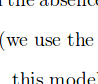

Detecting printed text
=======================
A neural network to detect whether a selected region has printed text or not. 

This code is the implementation of the following [paper](to fill)

The train, test files are generated by creating grayscale character images that are 32 x 32. They can be downloaded from [dropbox](https://www.dropbox.com/sh/n6b9fng8k4r1kd3/AAAyBIf7b5dM2XBPf24wR-d2a?dl=0).

##Input:

##Output:
non-text

##Input:

Output:
--------
text

